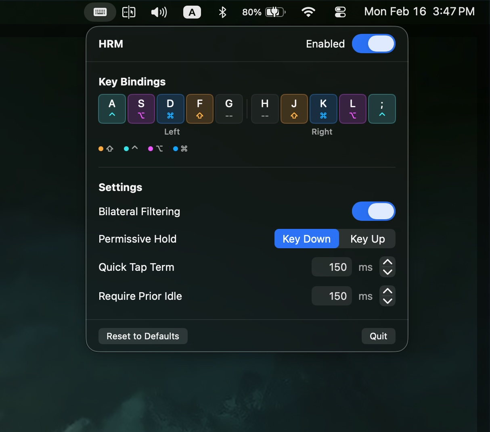

# HRM — Home Row Mods for macOS



A native macOS menu bar app that turns your home row keys into dual-function keys — tap for the letter, hold for a modifier. Built on a **timeless** tap-hold implementation where hold vs tap is decided entirely by other key activity, not by duration timers.

## How It Works

When you press a home row key:

- **Tap** (press and release with no other keys) — types the letter normally
- **Hold** (press, then press and release another key) — acts as a modifier (Shift, Control, Option, or Command)

Unlike timer-based implementations, HRM uses a **timeless** approach. There is no hold threshold timer — the decision is based purely on whether another key was pressed and released while the home row key was down. This eliminates the latency tradeoff between fast typing and reliable modifier activation.

## Default Layout

```
        Left Hand                 Right Hand
┌───┐┌───┐┌───┐┌───┐┌───┐  ┌───┐┌───┐┌───┐┌───┐┌───┐
│ A ││ S ││ D ││ F ││ G │  │ H ││ J ││ K ││ L ││ ; │
│ ⌃ ││ ⌥ ││ ⌘ ││ ⇧ ││   │  │   ││ ⇧ ││ ⌘ ││ ⌥ ││ ⌃ │
└───┘└───┘└───┘└───┘└───┘  └───┘└───┘└───┘└───┘└───┘
```

G and H are disabled by default. Each key's modifier assignment can be changed or disabled in the key binding detail view.

## Features

### Bilateral Filtering

Only triggers a hold when the other key is on the **opposite hand**. This prevents the most common misfire — fast same-hand rolls like "as" or "df" being misinterpreted as modifier combos.

- **Example**: Holding `A` (Control) + pressing `J` (right hand) = `Control+J`
- **Example**: Rolling `A` then `S` (both left hand) = types "as"

Enabled by default. Can be toggled globally or overridden per key.

### Permissive Hold

Controls **when** the bilateral hand check happens during a hold:

- **Key Down** (default) — checks the hand immediately when the other key is pressed. Same-hand keys are rejected instantly and resolve as a tap.
- **Key Up** — waits until the other key is released before checking. This allows combining multiple modifiers on the same hand (e.g., holding `A` + `S` for Control+Option) but adds slight latency to same-hand typing.

Only applies when Bilateral Filtering is enabled.

### Quick Tap Term

After tapping a home row key, pressing it again within this window **always types the letter** — it never enters the hold state. This makes it easy to repeat characters (e.g., typing "ll" quickly).

- **Default**: 150ms
- **Range**: 0–999ms (0 disables)

### Require Prior Idle

If any key was pressed within this time window, the home row key **immediately types the letter** instead of entering the undecided state. This prevents accidental holds during fast typing bursts.

- **Default**: 150ms
- **Range**: 0–999ms (0 disables)

## Per-Key Overrides

Each key binding can override the following global settings:

| Setting | Override Options |
|---|---|
| **Bilateral Filtering** | Global / On / Off |
| **Quick Tap Term** | Global value or custom ms |
| **Require Prior Idle** | Global value or custom ms |

Click any keycap in the panel to open its detail view and configure overrides.

## Requirements

- macOS 14.0 or later
- Accessibility permission (required to intercept keyboard events)

## Running

```bash
swift run
```

Builds and runs HRM directly from source. Your terminal app (e.g., Terminal, iTerm, Ghostty) must have Accessibility permission enabled in **System Settings > Privacy & Security > Accessibility**.

## Building

```bash
swift build -c release --arch arm64 --arch x86_64
```

This produces a universal binary at `.build/apple/Products/Release/HRM`.

## Releasing

The `scripts/release.sh` script automates building, code signing, notarization, and packaging:

```bash
# Pass credentials via env vars
APPLE_ID="your@email.com" APP_SPECIFIC_PASSWORD="xxxx-xxxx-xxxx-xxxx" ./scripts/release.sh

# Or run interactively (will prompt for credentials)
./scripts/release.sh
```

The script will:
1. Build a universal binary (arm64 + x86_64)
2. Create and sign an `HRM.app` bundle with Developer ID
3. Submit to Apple for notarization
4. Staple the notarization ticket
5. Package as `HRM.zip`

To publish a GitHub release:

```bash
gh release create v1.0 HRM.zip --title "HRM v1.0" --notes "Initial release"
```

## Credits

Created with [Claude Code](https://claude.ai/claude-code).

Built on concepts from:

- [Home Row Mods](https://precondition.github.io/home-row-mods) — comprehensive guide to home row mod concepts and configuration
- [Timeless Homerow Mods](https://github.com/urob/zmk-config#timeless-homerow-mods) — the timeless tap-hold approach that inspired this implementation
- [QMK Tap-Hold Documentation](https://github.com/manna-harbour/qmk_firmware/blob/retro-shift/docs/tap_hold.md) — QMK firmware tap-hold behavior reference
- [ZMK Hold-Tap Behavior](https://v0-3-branch.zmk.dev/docs/keymaps/behaviors/hold-tap) — ZMK firmware hold-tap documentation
